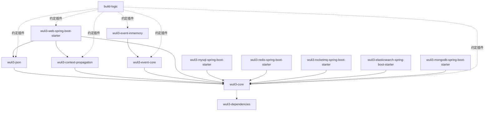

# 项目全景与事实基线

## 1. 项目定位

Wuli3 是面向后续 Spring Boot / DDD 业务工程复用的 Java 基础组件仓库。当前代码已经超出“脚手架模板”阶段：Core、JSON、上下文传播、事件契约和 Web 适配具备真实实现；与此同时，五个数据/中间件 starter 仍处于依赖聚合或占位阶段。

整体设计可概括为：

- 用 `build-logic` 统一工程规则，用 `wuli3-dependencies` 统一依赖版本。
- 用无 Spring 依赖的模块承载稳定机制和公共语义。
- 将协议、框架和中间件集成放在 adapter/starter 层。
- 用 JSpecify + NullAway、Error Prone 和构建门禁前移质量约束。
- 对事件等尚未出现完整基础设施需求的能力，先定义小契约，再按真实场景增加实现。

## 2. 分析基线

| 项目 | 基线 |
| --- | --- |
| 分析日期 | 2026-07-10 |
| Git HEAD | `b150bbc1f6fdd9ea9cca13be2979d6fcfab62fa6` |
| 版本 | `com.kjs.wuli3:0.1.0-SNAPSHOT` |
| Java | JDK 21，实际 Launcher/Daemon JVM 21.0.2 |
| Gradle | 9.6.0 |
| Spring Boot BOM | 3.5.15 |
| MyBatis-Plus BOM | 3.5.16 |
| 子项目数 | 12（含 BOM） |

分析开始时工作区存在用户已有的未跟踪文件 `wuli3-core/docs/design-analysis.md`。本次仅将其作为辅助材料，不修改、不覆盖、不暂存；事实结论以当前源码、构建脚本、测试和实际命令结果为准。

## 3. 模块依赖图

箭头表示“依赖于”。虚线表示构建期治理而非运行时调用。



各 Java 子项目还通过约定插件消费 BOM。图中省略第三方库和重复的治理连线。当前 Gradle project 依赖没有循环。

## 4. 模块矩阵

成熟度仅描述当前实现范围，不表示版本稳定承诺。

| 模块 | 当前职责 | 实现状态 | 主要边界 |
| --- | --- | --- | --- |
| `build-logic` | Java/Spring/质量约定插件 | 工程治理已实现 | 独立 included build，不与主构建隐式共享发布配置 |
| `wuli3-dependencies` | 第三方依赖版本平台、Maven BOM | 已实现 | 只管版本，不决定模块是否依赖某个库 |
| `wuli3-core` | 错误、断言、ID、时间、Stream/金额工具 | 已实现，当前检查失败 | 保持纯 JDK、无 Spring；公共契约需收敛 |
| `wuli3-json` | 标准 Jackson 组装、JSON 门面、资源路径、脱敏 | 已实现 | 机制与具体 Web 路径解析分离 |
| `wuli3-context-propagation` | 线程上下文、快照、carrier/codec/transmitter | 已实现 | 不认证外部身份，不绑定具体协议 |
| `wuli3-event-core` | 领域/集成事件与发布处理契约 | 早期实现 | 不负责 MQ、outbox、可靠投递 |
| `wuli3-event-inmemory` | Executor 驱动的进程内异步事件总线 | 早期实现 | 非持久化，关键并发/生命周期语义待固化 |
| `wuli3-web-spring-boot-starter` | Web 上下文、统一响应、异常、JSON 集成 | 已实现，覆盖面最完整 | 默认策略较多，需要持续控制侵入性 |
| `wuli3-mysql-spring-boot-starter` | MyBatis-Plus starter 依赖聚合 | 占位/聚合 | 空自动配置，无 Wuli3 运行时增强 |
| `wuli3-redis-spring-boot-starter` | Spring Data Redis + Redisson 聚合 | 占位/聚合 | 空自动配置，无统一序列化等项目行为 |
| `wuli3-rocketmq-spring-boot-starter` | RocketMQ starter 聚合 | 占位/聚合 | 尚未连接 event contract 或上下文传播 |
| `wuli3-elasticsearch-spring-boot-starter` | Spring Data Elasticsearch 聚合 | 占位/聚合 | 空自动配置 |
| `wuli3-mongodb-spring-boot-starter` | Spring Data MongoDB 聚合 | 占位/聚合 | 空自动配置 |

## 5. 构建治理现状

### 5.1 已建立的约束

- 根设置统一 Maven Central，并以 `FAIL_ON_PROJECT_REPOS` 禁止子项目自行漂移仓库。
- `java-conventions` 统一 JDK 21、`-parameters`、编译警告、JUnit Jupiter、AssertJ、Lombok 和源码包。
- `quality-conventions` 统一 Spotless、Checkstyle、SpotBugs、Forbidden APIs、Error Prone 和 NullAway。
- 每个 Java 模块的 `check` 显式依赖 `jacocoTestCoverageVerification`，默认行覆盖率下限为 45%。
- JaCoCo XML/HTML 报告已配置，但 `jacocoTestReport` 没有被显式接入 `check`。
- 测试源码默认不执行 Forbidden APIs；这是配置选择，不应在文档中误写为全源码覆盖。
- 根 `gradle.properties` 当前提交了 `/Users/guoyang/.../java/21.0.2` 本机绝对路径；这不属于可复用构建配置，应由环境/toolchain 自动发现或用户级配置替代。
- NullAway 通过 `AnnotatedPackages=com.kjs.wuli3` 检查源码，但 Context 的 `accessor/context/store`、JSON 的 `provider`、Web 的 `config.properties/json` 等公共包没有 `@NullMarked` package-info；外部消费者看到的 JSpecify 默认空语义并不完整。

### 5.2 发布边界

实际 task 列表显示：只有 `wuli3-dependencies` 提供 Maven publication 和 `publishToMavenLocal`。普通 Java 库与 Spring starter 目前只有 Jar/Sources Jar 构建任务，没有 Maven 发布任务。

`build-logic` 自身具备公司 Maven 仓库配置，但 included build 是独立 Gradle build；其 repository/publishing 设置不会自动成为主构建 BOM 或组件的发布目标。因此当前仓库能可靠证明的是 BOM 本地发布，不是全部组件的正式发布闭环。

## 6. 测试与验证基线

生产/测试 Java 文件数量仅用于观察分布，不能代替行为覆盖率：

| 模块 | 生产文件 | 测试文件 | 评价 |
| --- | ---: | ---: | --- |
| core | 29 | 5 | error、stream 缺少直接契约测试 |
| json | 40 | 5 | 主路径有覆盖，注解组合与失败矩阵仍需加强 |
| context-propagation | 31 | 2 | 两个测试类场景较丰富，浅复制扩展边界未覆盖 |
| event-core | 10 | 1 | 主要为值对象基本测试 |
| event-inmemory | 2 | 1 | 只覆盖单处理器成功/失败 |
| web starter | 47 | 3 | 三个测试类包含大量场景，仍需过滤器安全边界与拆分条件测试 |
| 五个聚合 starter | 各 2 | 各 1 | 只证明空自动配置可加载 |

### 6.1 全量检查结果

执行命令：

```bash
./gradlew check
```

结果为失败，且属于仓库当前基线问题：

1. `:wuli3-core:compileTestJava`：`AssertsTest` 有 5 处调用了生产代码不存在的二参数重载。
2. Core、JSON、Web 的 Spotless 任务失败，涉及 3 个 Core 文件、1 个 JSON 文件及 4 个 Web 文件。
3. `:wuli3-web-spring-boot-starter:test` 的 39 个测试中 6 个失败：5 个是 MESSAGE_ONLY 策略与旧测试期望不一致，1 个暴露 `@ResourcePath` 未支持 type 会生成非法 JSON。
4. `help --warning-mode all` 将 Gradle 10 弃用项定位为约定插件使用 `Project` 对象作为依赖 notation。

使用 `--continue` 后，Context、Event、五个聚合 starter 的检查完成；JSON 行为测试通过但格式失败；Web 同时有格式和行为测试失败；Core 无法编译测试。当前不能形成可发布基线。

## 7. 总体判断

项目的正确主干已经建立：治理集中、基础机制无框架依赖、协议适配向外、事件契约与实现分离。当前瓶颈不是模块数量不足，而是公共语义、侵入式默认值、测试矩阵和发布能力尚未达到“基石项目”的稳定要求。

因此近期顺序应是：恢复构建基线 -> 收敛已有契约 -> 规范 starter -> 建立发布/兼容闭环 -> 再按真实需求扩展中间件能力。
