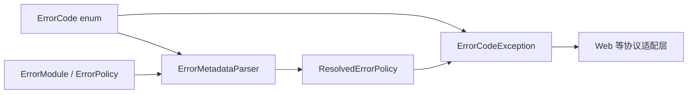
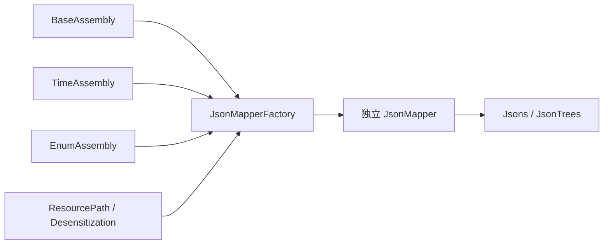
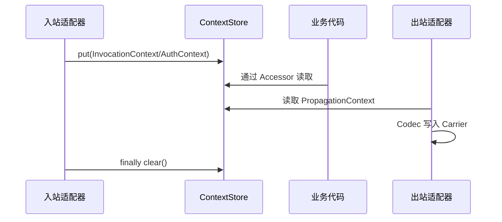

# 实现机制与设计思路

## 1. 分析口径

本文按能力链而不是按目录逐项复述源码。每一节先还原当前实现，再评价设计边界。源码引用使用相对路径和类型名，避免行号随重构失效。

## 2. Core：框架无关的公共语义

`wuli3-core` 当前包含错误模型、断言、ID、时间区间和 Stream/金额聚合五组能力。它不依赖 Spring，这个边界应继续保持。

### 2.1 错误处理链

- `ErrorCode` 表达稳定错误身份和默认消息。
- `@ErrorModule` 提供模块名和默认严重度/可见性，字段级 `@ErrorPolicy` 可以覆盖默认策略。
- `ErrorMetadataParser` 负责反射解析与缓存，并已经对非枚举实现、缺少模块和空模块名给出框架错误。
- `ErrorCodeException` 携带错误码、cause、内部 detail 和解析后的策略；Web 层再决定 HTTP 状态与外部可见内容。

依赖方向是正确的：Core 不认识 HTTP，协议层只消费通用错误语义。`ErrorCode` 形式上是普通接口，但 Javadoc 已明确实现必须是 enum，默认方法与解析器在运行时共同执行该约束。这是 Java 无法用接口直接表达“任意枚举之一”的现实取舍，需要用直接契约测试保护，而不是继续重复补说明。只有出现真实动态错误码需求时，才拆分“错误身份”与“注解元数据来源”。

### 2.2 值对象和工具

- `DateRange`、`TimeRange` 使用半开区间 `[startInclusive, endExclusive)`，已经排除空区间重叠，并对 `LocalDate.MAX` 闭区间转换给出明确失败。
- `ClockProvider` 用最小端口隔离系统时钟，`IdGenerator<T>` 用最小接口隔离 ID 策略。
- `BigDecimalCollectors`、`MoreCollectors` 等提供精确金额聚合和显式重复键策略。
- `Asserts` 把条件判断与项目错误模型连接起来，采用“先判断、后选择异常”的链式风格。

这里的主要治理原则不是继续增加通用工具，而是要求进入 Core 的能力具有稳定语义、至少两个独立复用场景，并能在本模块测试中完整说明 null、并发和失败边界。

## 3. JSON：组装链与注解扩展

### 3.1 标准 Mapper 构建

`JsonMapperAssemblyChain` 将一个 JSON 关注点拆成 feature 配置和模块组装；`JsonMapperFactory` 按注册顺序应用组装链；`JacksonProvider` 提供项目标准配置和共享默认 `JsonMapper`。

这个设计比在静态代码块中持续修改一个全局 Mapper 更容易组合和测试。`standardJsonMapperFactory()` 每次创建独立实例，适合基础设施适配；`Jsons` 则使用 `JacksonProvider.defaultJsonMapper()` 作为项目级便利门面。

共享默认 Mapper 是一个需要明确的边界。Jackson 的 Mapper 完成配置后适合并发读写，但 `defaultJsonMapper()` 返回可变实例，任一消费者都能在运行期改变全局 JSON 行为。建议将其文档化为“只读共享实例”，并逐步优先暴露 `ObjectReader`、`ObjectWriter` 或独立工厂；若未来收紧 API，应通过新增替代接口和弃用周期迁移。

### 3.2 资源路径与脱敏

- `@ResourcePath` 通过 serializer/deserializer modifier 修改属性级行为，解析规则由 `ResourcePathResolver` 注入；Web 层提供基于配置的解析器。
- `@Desensitized` 将字段声明、策略注册和可见性判断分开。`DesensitizationStrategyRegistry.standardWithOverrides(...)` 允许应用按类型覆盖标准策略。
- 两类能力均通过 Jackson Module 组合，而不是写死到 `Jsons`，扩展方向合理。

需要持续守住的边界包括：仅处理明确支持的属性类型；未知策略启动或首次序列化时给出可定位错误；组合注解、字段/getter、record component 的解析规则保持一致；反序列化修改不得悄悄改变领域值语义。

## 4. 上下文传播：存储、快照与载体解耦

模块把上下文分为三层：

- `ContextStore`：当前线程的上下文容器。
- `ContextPropagator`：捕获快照、临时恢复并包装异步任务。
- `ContextTransmitter`：通过 codec 在协议无关 carrier 上读写可传播上下文。

`PropagationContext` 与 `LocalContext` 的区分，以及 `invocationOnly()` / `trustedInternal()` 两组 codec，是当前设计中很重要的安全边界：公网入站不能把用户身份 header 直接当成可信认证结果。

快照当前复制容器，但容器内保存的上下文对象和扩展 Map 仍是对象引用，因此是浅复制语义。结构替换已经被测试隔离，快照捕获后若原上下文对象的扩展内容继续变化，仍可能互相影响。目标方案应二选一：让上下文成为不可变值，或为 `Context` 定义明确的复制协议；不应把浅复制描述成完整深度隔离。

`ContextTransmitter.readFrom(...)` 对缺失或非法字段采用忽略策略，适合容错传播，但必须由协议适配层决定信任等级、长度限制和来源校验。Core codec 不承担身份认证。

## 5. 事件：契约与单进程异步实现

`wuli3-event-core` 用 `EventEnvelope` 统一事件身份、发生时间、类型、版本和 metadata，并用 `DomainEvent`、`IntegrationEvent` 区分服务内与服务间语义。模块明确不绑定 MQ，也不实现 outbox，这一职责边界是合理的。

`InMemoryEventBus` 的行为如下：

- 按注册类型的 `isAssignableFrom` 匹配处理器，允许注册父接口处理多种事件。
- 每个处理器通过给定 `Executor` 异步执行，`publish` 返回 `CompletionStage<Void>`。
- 任一处理器失败会使返回阶段失败；其他已提交处理器不会被取消。
- 注册表使用并发 Map 与 `CopyOnWriteArrayList`，支持并发读取和低频注册。

当前契约没有说明处理顺序、重复注册、反注册、关闭或背压语义；实现也不拥有外部传入的 Executor，因此不应擅自关闭它。近期应先补 Javadoc 和并发/多处理器测试，准确说明一次 `publish` 如何提交当前匹配的处理器，以及部分提交/执行失败如何反映到返回阶段，避免使用可靠消息意义上的投递保证术语。只有出现动态插件或长生命周期订阅场景时再增加可关闭 subscription；只有出现跨服务可靠投递需求时，才新增 MQ/outbox 实现，而不是扩张内存总线。

## 6. Web Starter：边界适配与默认策略

`WebAutoConfiguration` 组合了四条主链：

1. Jackson：注册 Java Time、资源路径和脱敏模块。
2. 上下文：创建 Store、Accessor、Propagator、Transmitter，并通过 `ContextFilter` 建立请求上下文。
3. 成功响应：`ApiResponseBodyAdvice` 将普通 Controller 返回值包装为 `ApiResponse<T>`。
4. 异常响应：`WebExceptionHandler` 将业务错误与框架异常映射为统一响应或 `ProblemDetail`。

值得保留的设计包括：默认 Bean 多数通过 `@ConditionalOnMissingBean` 允许应用替换；下载、字节、流式响应、SSE、204/304 和 `ProblemDetail` 明确绕过统一包装；`@NativeResponse` 区分仅跳过成功包装和完全使用原生错误体；错误告警通过 `ErrorAlertNotifier` 扩展，而不是在异常处理器中绑定具体通知渠道。

需要改进的地方：

- `WebErrorCodeResolver` 是关键扩展点，但其 Bean 没有 `@ConditionalOnMissingBean(ErrorCodeResolver.class)`；应用提供同类型 Bean 时可能形成注入歧义，与“默认 Bean 可替换”的设计说明不一致。
- `WebAutoConfiguration` 同时承担 JSON、上下文、响应和错误四个关注点，属性开关不能阻止所有无关 Bean 创建。后续宜拆成若干 package-private 自动配置，并使用 `@AutoConfiguration(after/before)` 明确顺序。
- `ContextFilter` 默认缓存 JSON、表单和文本请求体，这是有内存与行为成本的侵入式策略。应评估改为默认关闭，或仅在存在明确消费者时启用。
- `acceptExternalRequestId=true` 需要与网关信任模型配套。现有长度/非法值策略是良好起点，但还应测试字符集、日志注入和代理边界。
- 配置属性主要依赖 Lombok 可变 Bean，缺少 Bean Validation 约束；空 header 名、负长度、非正 body 上限等非法配置应在启动阶段失败。

## 7. 数据与中间件 Starter：当前是依赖聚合

MySQL、Redis、RocketMQ、Elasticsearch、MongoDB 五个 starter 均注册了空的 `@AutoConfiguration`，并通过 `api(...)` 暴露对应第三方 starter。它们当前提供的是：

- 统一依赖坐标和版本；
- Spring Boot 自动配置导入入口；
- 最小的上下文加载测试。

它们尚未提供项目级配置属性、默认 Bean、可观测性、异常适配或领域抽象。因此文档和 artifact 描述必须称其为“依赖聚合/占位 starter”，不能暗示已形成 Wuli3 增强能力。

后续不要为了填充空配置而制造统一 Repository、Client 或模板封装。每个 starter 只有在出现至少一个跨业务稳定需求时再增强，例如可重复的序列化约定、事务边界、健康检查标签、上下文透传或项目级安全默认值，并为每项默认行为提供开关、退让条件和自动配置测试。

## 8. 构建与依赖治理

`build-logic` 将 Java 工具链、测试、JaCoCo、Spotless、Checkstyle、SpotBugs、Forbidden APIs、Error Prone 和 NullAway 集中到约定插件；`wuli3-dependencies` 导入外部 BOM 并约束其他依赖版本；根设置禁止模块自行声明仓库。这构成了较好的工程治理骨架。

当前边界包括：

- `check` 已依赖 JaCoCo coverage verification，默认全模块行覆盖下限为 45%；XML/HTML report 任务本身没有明确接入 `check`。
- 主构建只有 BOM 定义 Maven publication，普通库和 starter 暂无发布闭环。
- `build-logic` 是独立 included build，其发布仓库配置不会自动作用到主构建。
- Gradle 9.6 已报告弃用功能，升级 Gradle 10 前需要用 `--warning-mode all` 建立清单。
- Core 当前除 BOM 平台元数据外没有第三方运行时库；Context 的 Guava 仅用于并发 Map 工厂，Event Core 与五个聚合 starter 依赖 Core 却没有源码用法，Web 也声明了多项没有直接源码用法的工具依赖。这些模块应逐项压缩实际 classpath 和未来发布 POM。

## 9. 总体设计判断

项目已经形成“纯 Java 公共语义 -> 协议无关上下文/事件/JSON -> Spring Web 适配”的正确主干。当前最重要的方向不是快速增加模块，而是让现有公共契约、构建基线、发布链路和测试矩阵达到基础库应有的稳定程度。数据类 starter 在真实共同需求出现前保持轻量是合理的，但应诚实标注成熟度。
