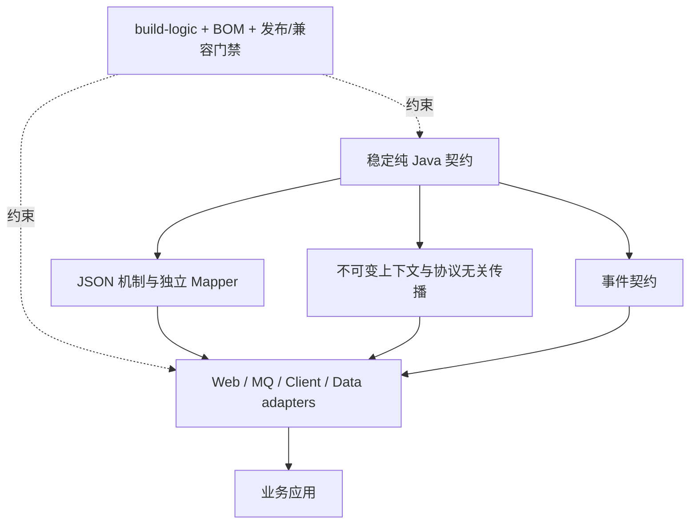

# 分阶段演进路线

## 1. 路线原则

演进顺序遵循四条约束：

1. 先恢复可信基线，再讨论功能扩展。
2. 先固化已有公共语义，再增加新的公共抽象。
3. 每个阶段都必须可独立交付、验证和回退。
4. 数据与中间件能力由真实跨项目需求驱动，不以填满 starter 为目标。

本文不承诺具体日历工期。实施优先级取决于风险和依赖关系，而不是代码量。

## 2. 阶段 0：恢复可信基线

### 目标

让当前仓库重新成为可编译、可测试、可解释的开发基线。

### 实施顺序

1. 保留 `Asserts` 已记录的链式 API，删除漂移的返回值测试。
2. 修复全仓 Spotless 违规。
3. 修复未知 `@ResourcePath` type 生成非法 JSON，并按 MESSAGE_ONLY 既有策略校正 Web 测试。
4. 修复已定位的 Gradle 10 Project dependency notation 弃用项。
5. 删除根 `gradle.properties` 中的用户 JDK 绝对路径，验证 toolchain 可发现性。
6. 在根文档标明五个依赖聚合 starter 的实际成熟度。
7. 为 `check` 建立“任务、源码范围、阈值、是否阻断”矩阵。

### 验收标准

- 全量 `clean check` 连续成功。
- 没有测试调用不存在的公共 API。
- 当前版本的已知 Gradle 弃用项有负责人或明确处置结论。
- README 不再把依赖聚合模块描述为已有业务增强能力。

### 回退原则

本阶段不改变运行时行为。任何为通过检查而修改公共 API 的方案都应退回，先明确契约决策。

## 3. 阶段 1：收敛现有公共契约

### 目标

消除调用方必须阅读实现才能理解的关键语义。

### 实施顺序

1. 为已经明确的 `ErrorCode` enum-only 约束补错误元数据直接测试。
2. 明确默认 `JsonMapper` 所有权，新增独立构建或只读导向 API。
3. 定义上下文快照的隔离等级，优先推动上下文不可变。
4. 为事件总线写明并测试异步、顺序、失败和 Executor 所有权语义。
5. 修复 Web 默认 `ErrorCodeResolver` 的 Bean 退让并补自动配置测试。
6. 审查 Web 请求体缓存和外部 requestId 默认值，补安全/资源边界测试。
7. 补齐公共包的 JSpecify `@NullMarked` 契约。
8. 清理 Context、Event、聚合 starter 和 Web 的未使用依赖，核对发布 POM 预期。

### 兼容要求

- 文档澄清和新增测试可以在补丁版本完成。
- 新增替代 API 后保留旧入口并标记弃用；二进制不兼容调整留到主版本。
- 修改 Web 默认值必须提供显式旧行为配置和迁移说明。

### 验收标准

- 错误、JSON、上下文和事件的公共 Javadoc 包含线程安全、所有权和失败语义。
- 关键契约均有本模块直接测试，而非只靠下游间接覆盖。
- 基础模块的第三方运行时依赖均有不可替代的使用依据。

## 4. 阶段 2：强化 Starter 一致性

### 目标

形成可复制的 Spring Boot starter 设计模板，降低新增能力时的隐式行为和测试成本。

### 实施顺序

1. 将 Web 的 JSON、Context、Response、Error 拆成内部自动配置单元。
2. 给配置属性增加启动期校验，并完善配置元数据与 README。
3. 建立统一自动配置测试模板：默认装配、开关关闭、用户覆盖、缺类、非法配置、关闭生命周期。
4. 为错误告警、上下文和响应处理增加必要的 metrics/logging 约定，但不绑定具体监控后端。
5. 为五个依赖聚合 starter 建立能力准入规则；只有真实共同需求通过评审后才增加默认行为。

### Starter 能力准入条件

一个新增默认行为至少应满足：

- 在两个独立业务项目中重复出现。
- 能用稳定的基础设施语义描述，而非特定业务规则。
- 有显式启用/关闭或合理的条件装配。
- 用户自定义 Bean 可以覆盖默认实现。
- 有成功、退让、非法配置和资源释放测试。
- 能说明升级与回退方式。

### 验收标准

- Web 各关注点可独立启停和测试。
- 所有新增 Bean 的条件和覆盖方式在文档中可查。
- 依赖聚合 starter 未因路线图压力引入空泛公共抽象。

## 5. 阶段 3：建立发布与兼容闭环

### 目标

让 BOM、公共组件和构建约定能够被外部项目可靠消费和升级。

### 实施顺序

1. 定义哪些模块是对外发布组件，哪些仅为内部实现。
2. 新增发布约定，统一源码/Javadoc、POM、许可证、SCM 和版本元数据。
3. 将所有目标组件与 BOM 发布到临时 Maven 仓库。
4. 使用独立 Gradle 与 Maven 示例验证 BOM 导入、无版本依赖、传递 scope 和运行加载。
5. 增加 API/ABI 兼容检查，0.x 先报告，1.0 前升级为发布门禁。
6. 在主构建配置正式仓库路由和凭据来源，区分快照与正式版本。
7. 明确发布顺序：质量检查 -> 兼容检查 -> 临时消费验证 -> 组件 -> BOM。

### 验收标准

- BOM 不引用无法发布或版本不一致的内部组件。
- 外部 Gradle/Maven 消费样例在空缓存环境可解析并运行。
- 发布任务不依赖本地绝对路径或仓库内明文凭据。
- 每次破坏性 API 变化都有版本边界和迁移说明。

## 6. 阶段 4：按需求扩展生产能力

### 候选方向

- 事件：当出现跨服务可靠投递需求时，引入 outbox 与具体 MQ adapter，并把投递保证、幂等和序列化版本作为首要契约。
- 上下文：按协议增加 Servlet 出站、HTTP client、Dubbo、消息 header 和 Spring TaskDecorator 适配模块。
- 数据 starter：只沉淀可验证的序列化、事务、审计、健康检查或观测约定。
- 错误模型：当动态错误码或多协议适配成为真实需求时，再分离 identity、metadata source 和 renderer。
- 平台治理：建立架构决策记录、依赖升级节奏、漏洞响应和兼容矩阵。

### 进入条件

每个方向必须先有具体消费方、失败案例或重复实现证据。无法说明消费者、稳定语义和验收场景的提案留在候选区，不进入公共 API。

## 7. 目标架构

目标不是让所有模块拥有相同形状，而是保持依赖方向、所有权、失败语义和扩展方式一致。
