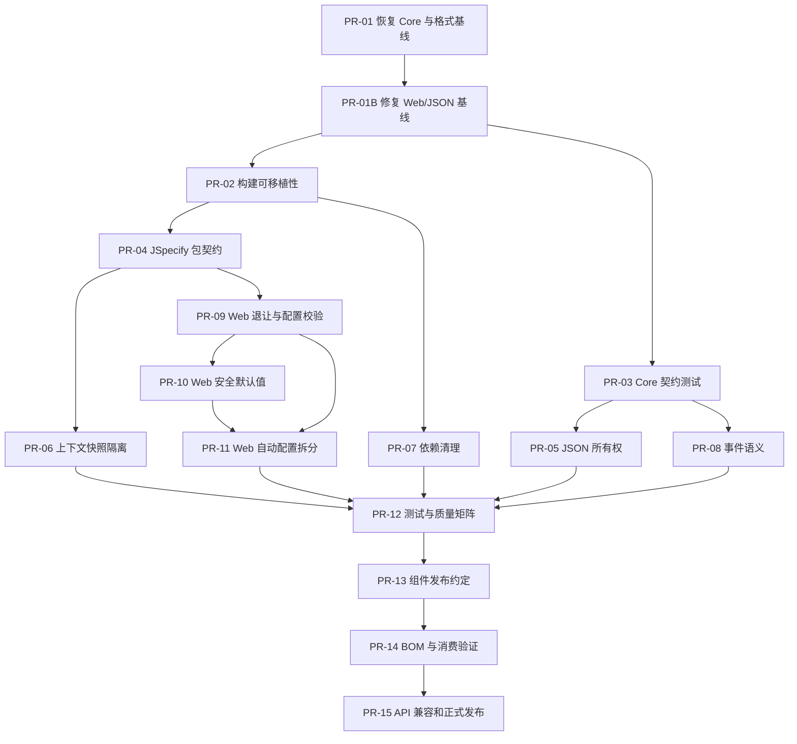

# 问题修复实施计划

## 1. 目标与约束

本计划把 [设计评价与改进建议](03-design-assessment.md) 中的 F-01 至 F-18 转换为可直接拆分 PR 的实施顺序。目标是在不混入新业务功能的前提下，依次恢复构建、收敛公共契约、修正 Web 默认行为、规范自动配置，最后建立发布闭环。

实施约束：

1. 每个 PR 只处理一个可独立验证的目标，禁止顺手重构无关代码。
2. 先写失败或契约测试，再修改实现；文档和迁移说明与行为变更同 PR 提交。
3. 0.1.x 阶段保持源码和二进制兼容；安全默认值允许行为调整，但必须保留配置迁移路径并在发布说明中突出标记。
4. 修改默认行为时保留显式配置恢复旧行为，并在发布说明中列出迁移方式。
5. 每个 PR 至少执行影响模块的 `check`；阶段关口执行 `./gradlew clean check`。

## 2. 决策摘要

| 领域 | 最终选择 | 不采用的方案 |
| --- | --- | --- |
| `Asserts` | 保留现有延迟抛错链式 API，删除漂移的返回值测试 | 不为修复构建临时增加五组重载 |
| `ErrorCode` | 保留 enum-only 模型，补契约测试 | 没有动态错误码需求时不引入 registry |
| JSON | 新增每次返回独立实例的 `JacksonProvider.newJsonMapper()`；共享入口先文档化、再弃用 | 不突然让 `defaultJsonMapper()` 返回 copy |
| 上下文快照 | `Context` 增加默认 `snapshotCopy()`；容器复制逐项调用；可变内置上下文深度复制扩展 Map | 不强制所有第三方 Context 立即实现新抽象 |
| 内存事件总线 | 固化“同一 publish 内并行提交、无顺序保证、失败由返回 stage 聚合、Executor 归调用方” | 当前不增加反注册、背压或 MQ 语义 |
| 外部 requestId | 继续默认接受，但只接受现有受控字符集和长度；移除/禁用 `USE_AS_IS` 绕过路径 | 不因安全担忧直接破坏现有链路追踪 |
| 请求体缓存 | 默认改为关闭；需要重复读取的应用显式开启，保留 1 MiB 上限 | 不让通用 starter 默认承担全量请求内存复制 |
| Web 自动配置 | 先修 Bean 退让和配置校验，再按 JSON/Context/Response/Error 拆内部配置 | 不在行为未固化前同时重构结构和语义 |
| 聚合 starter | 0.1.x 保留 artifact，明确依赖聚合定位，删除无用 Core 依赖 | 不创建空泛 Repository/Client 抽象 |
| 发布 | 公共 Java 组件统一发布；`build-logic` 保持独立发布；先临时仓库消费验证 | 不直接以本地 Maven 成功代替正式发布验证 |

## 3. PR 依赖图



允许并行的分支：PR-03/04/07 可在 PR-02 后并行；PR-05/06/08/09 可在各自前置完成后并行。PR-10 与 PR-11 不并行，避免默认行为调整与结构拆分产生难以审查的冲突。PR-01 和 PR-01B 必须先串行完成，因为当前 `check --continue` 证明基线同时存在编译、格式和行为测试失败。

## 4. 阶段 A：恢复工程基线

### PR-01：恢复 Core 可编译基线并统一全仓格式

**覆盖问题**：F-01。

**改动**：

- 删除 `AssertsTest.returnsValidatedValues()`；保留 `Asserts` 当前链式 API，不新增返回对象的重载。
- 为链式设计补一个测试，验证断言通过后调用方仍继续使用原变量；现有操作手册已经明确“不返回被校验对象”，无需改变公共说明。
- 对 `check --continue` 报告的 Core、JSON、Web 文件运行现有 Spotless 格式化；不手工维护第二套格式规则。
- 检查格式 diff 不包含逻辑变化。

**测试**：

- 所有断言的满足/失败/null/空值边界。
- `reversed()`、自定义消息和 `throwIllegalArgumentException()`。

**验收命令**：

```bash
./gradlew :wuli3-core:check
./gradlew :wuli3-json:spotlessCheck
./gradlew :wuli3-web-spring-boot-starter:spotlessCheck
```

**兼容与回退**：无生产 API/行为变化；可以整 PR 回退。全仓 Spotless 通过不代表行为测试已恢复，PR-01 阶段不要求全量 `check` 通过，后续由 PR-01B 处理。

### PR-01B：修复 JSON 资源路径缺陷并对齐 Web 错误策略测试

**覆盖问题**：F-01，并新增记录 F-18（`@ResourcePath` 未支持类型生成非法 JSON）。

**事实与决策**：

- `SystemErrors` 的模块默认可见性是 `MESSAGE_ONLY`；`WebErrorResponseMapper` 应隐藏 `SYSTEM.*` code 并返回 `WEB.INTERNAL_ERROR`，同时保留可见消息。5 个失败断言仍期望旧的 `SYSTEM.ILLEGAL_ARGUMENT`，应修测试，不改生产可见性策略。
- `ResourcePathJsonSerializer` 对 resolver 不支持且 type 不是 `default` 的字符串没有向 generator 写任何 token，实际生成非法 JSON。这是生产缺陷；正确行为与反序列化一致，应该原样写出字符串。

**改动**：

- `ResourcePathJsonSerializer` 对所有 resolver 不支持的 String 值执行 `gen.writeString(strValue)`；删除仅允许 `default` 原样输出的分支差异。
- 新增 JSON 模块测试：未知 type 的序列化和反序列化都原样保留，并且输出可被标准 Mapper 再次解析。
- Web 测试中将 MESSAGE_ONLY 场景的 code 期望改为 `WEB.INTERNAL_ERROR`；message 仍断言为原业务消息。
- `ErrorAlertNotifier` 继续接收最终对外 `responseCode`，因此对应期望改为 `WebErrors.INTERNAL_ERROR`；另断言 `context.error()` 仍携带原始 `ErrorCodeException`，避免丢失诊断身份。
- 增加 CODE_ONLY、MESSAGE_ONLY、PUBLIC、INTERNAL 四种策略到 `ApiResponse` 和 `ProblemDetail` 的参数化矩阵，防止策略/测试再次漂移。

**验收命令**：

```bash
./gradlew :wuli3-json:check
./gradlew :wuli3-web-spring-boot-starter:check
./gradlew clean check --continue
```

**兼容与回退**：资源路径修复只改变原本无效的 JSON 输出；错误响应生产行为不变，仅校正测试。若业务明确要求 `SYSTEM.*` code 对外可见，应通过字段级 `@ErrorPolicy(visibility = PUBLIC)` 新增专用错误码，而不是修改整个 System 模块默认策略。

### PR-02：修复构建可移植性与 Gradle 10 弃用项

**覆盖问题**：F-14、F-16，以及 F-13 的测试基础。

**改动**：

- 删除根 `gradle.properties` 中 `org.gradle.java.installations.paths=/Users/...`；Java 21.0.2 继续由 `mise.toml` 描述，构建仅声明 Java 21 toolchain。
- 修改 `JavaConventionsPlugin` 的项目 BOM 依赖创建：不要先返回 `Project` 对象再传给 `platform(...)`；在 `DependencyHandler` 上使用 `project(projectBomPath)` 创建 `ProjectDependency`，外部 BOM 继续使用坐标字符串。
- 在 `build-logic` 增加 Gradle TestKit：一个 fixture 使用本地 project BOM，一个 fixture 使用坐标 BOM，断言 Java toolchain、JUnit、质量任务和四个 platform configuration 正确。

**验收命令**：

```bash
./gradlew javaToolchains
./gradlew help --warning-mode fail
./gradlew -p build-logic test
./gradlew clean check
```

在没有用户级 `org.gradle.java.installations.paths` 的干净环境再运行一次 `javaToolchains` 和 `check`。

**兼容与回退**：构建行为等价；若 CI 无法发现 JDK，修复 CI/mise 配置，不把个人路径恢复到仓库。

### 阶段 A 关口

- `clean check` 通过。
- `help --warning-mode fail` 通过。
- 仓库不含个人绝对路径。
- 约定插件具备最小 TestKit 回归保护。

## 5. 阶段 B：收敛基础公共契约

### PR-03：补齐 Core 错误与 Stream 契约测试

**覆盖问题**：F-02、F-12（Core 部分）。

**改动**：只新增测试和必要 Javadoc，不改 enum-only 设计。

**测试矩阵**：

- `ErrorMetadataParser`：模块默认策略、字段覆盖、空模块、缺少模块、非 enum 实现。
- `ErrorCodeException`：cause、detail、severity/visibility 覆盖、updater 返回 null。
- `BigDecimalCollectors`：空流、全 null、负数、scale、并行 combine、average 舍入。
- `MoreCollectors` / `MapMerger`：重复 key 策略、插入顺序、并行流与 null 边界。
- `StreamUtils.distinctBy`：顺序流行为；并行流只验证去重，不承诺 encounter-first。

**验收**：`:wuli3-core:check` 通过；测试名称能直接表达公共契约。

### PR-04：补齐 JSpecify 包级契约

**覆盖问题**：F-17。

**改动**：

- 为 Context 的 `accessor`、`context`、`store`，JSON 的 `provider`，Web 的 `config.properties`、`json` 增加 `@NullMarked` package-info；同时扫描所有 `com.kjs.wuli3` 生产包，补齐剩余遗漏。
- 对框架覆写方法或真实允许 null 的参数/返回值使用 `@Nullable`/`@NullUnmarked`，不通过关闭 NullAway 规避。
- 修正生产代码内缺少 `final` 与 `this` 的位置，只限受影响文件，遵守项目规范。

**测试**：全部模块编译与 NullAway；对新增 nullable 契约补边界测试。

**验收**：每个公共生产包要么有 `@NullMarked`，要么有说明充分的 `@NullUnmarked`；`clean check` 通过。

### PR-05：收敛 JSON Mapper 所有权

**覆盖问题**：F-03、F-12（JSON 部分）。

**公共 API**：

- 新增 `JacksonProvider.newJsonMapper()`，每次返回按标准组装链创建的独立 `JsonMapper`。
- 保留 `defaultJsonMapper()` 返回同一共享实例，在 Javadoc 标注 `@Deprecated(forRemoval = false)`，说明只用于兼容、禁止调用 register/configure/set 等变更方法。
- `Jsons.execute(...)` 同样会把共享 Mapper 暴露给任意回调，因此一并标记弃用；新增 `Jsons.execute(ObjectMapper, JsonErrors, JsonFunction)` 供自定义低层操作显式传入独立 Mapper。常用 `toJson/fromJson` 不变。
- `Jsons`、`JsonTrees` 内部继续使用私有共享 Mapper 以保持行为和性能；外部基础设施和新代码改用 `newJsonMapper()` 或 `JsonMapperFactory`。
- `JacksonProvider.javaTimeModule()` 当前每次创建新 Module，可继续保留；`featuresToEnable/Disabled()` 返回新数组，不共享可变容器。
- 不新增一个无法真正阻止 mutation 的“只读 ObjectMapper”包装类型。

**测试矩阵**：

- 两次 `newJsonMapper()` 返回不同实例，修改其中一个不影响另一个及 `Jsons`。
- 使用新 `execute` 重载修改显式传入的 Mapper 不影响 `Jsons` 私有默认 Mapper。
- 新旧入口的时间、枚举和 base features 一致。
- 并发序列化/反序列化不改变配置。
- 资源路径与脱敏继续通过显式 assembly 注入。

**兼容与迁移**：源码/二进制兼容；0.1.x 只弃用不移除。1.0 前根据仓库外调用统计决定是否移除共享入口。

### PR-06：修复上下文快照对象共享

**覆盖问题**：F-04、F-12（Context 部分）。

**公共 API 与实现**：

- 在 `Context` 增加默认 `Context snapshotCopy() { return this; }`；默认语义是“上下文不可变，可安全复用”。这是向接口增加 default 方法，不破坏已有实现类的加载；但它仍属于公共 API 增量，必须由 PR-15 的兼容报告建立基线。
- `ContextContainer.copy()` 不再仅复制 Map，而是对每个 value 调用 `snapshotCopy()`，仍以 `context.type()` 为 key 构造新容器。
- `AbstractContext` 增加受保护的扩展快照/复制辅助方法，返回不可变 Map，并允许子类导入扩展副本；用 JDK `ConcurrentHashMap` 替换 Guava。
- `InvocationContext`、`AuthContext` 和 `WebContext` 覆写 `snapshotCopy()`，创建字段等价的新对象并复制扩展 Map 结构；这里不是对任意扩展值做递归深拷贝。
- Javadoc 明确：扩展值本身必须是不可变值；框架只复制扩展 Map，不递归克隆任意对象。自定义可变 `Context` 必须覆写 `snapshotCopy()`。

**测试矩阵**：

- 捕获后修改原上下文扩展不影响快照，修改恢复后的扩展也不影响快照。
- 嵌套 scope、任务抛异常、线程池复用均恢复原上下文并清理 ThreadLocal。
- 默认不可变自定义 Context 可复用；自定义可变 Context 覆写后正确隔离。
- `ContextContainer.values()` 和快照 getter 不泄漏容器可变结构。

**兼容与回退**：默认方法保持已有实现可加载；如果未知自定义 Context 实际可变，文档和发布说明要求覆写。不要在 0.1.x 将 `ExtendableContext.put` 直接删除。

### PR-07：清理无效与可替代依赖

**覆盖问题**：F-11、F-06 的依赖部分。

**改动**：

- Context 删除 Guava（已由 PR-06 替换）。
- Event Core 删除无源码用途的 `api(project(":wuli3-core"))`。
- MySQL、Redis、RocketMQ、Elasticsearch、MongoDB starter 删除无源码用途的 Core API 依赖；保留各自第三方 starter 的 `api`，因为模块定位就是依赖聚合。
- Web 删除无源码用途的 Guava、Hutool、Commons Collections、Commons Text、Commons IO；将唯一的 Commons Lang 用法改为 JDK `isBlank` 后一并删除。
- JSON 将 `hutool-all` 收窄为实际承载 `DesensitizedUtil` 的 `cn.hutool:hutool-core`，并在 BOM 增加同版本约束、移除 `hutool-all` 约束；不为避免一个依赖而复制脱敏算法。

**验收**：

```bash
./gradlew clean check
./gradlew :wuli3-context-propagation:dependencies --configuration runtimeClasspath
./gradlew :wuli3-web-spring-boot-starter:dependencies --configuration runtimeClasspath
```

保存变更前后的 runtimeClasspath 对比；不得因清理改变公共 `api` 中实际暴露的 Jackson/Spring 类型解析。

### PR-08：固化内存事件总线语义

**覆盖问题**：F-05、F-12（Event 部分）。

**契约决策**：

- `publish` 对调用开始时匹配的每个已注册 handler 提交一次任务；不声明可靠消息意义上的至少一次/至多一次保证。
- handler 之间无执行或完成顺序保证；相同 handler 重复注册会重复执行。
- 无 handler 时返回已成功完成的 stage。
- 任一 handler 失败时返回 stage 异常完成；已提交的其他 handler 不取消，`CompletableFuture.allOf` 只保证报告至少一个失败，不提供完整异常列表。
- Executor 由构造方拥有，EventBus 不关闭。
- 本阶段不新增 unregister、subscription、priority、backpressure。

**实现**：补 `Objects.requireNonNull`、`final`、`this` 与 Javadoc；如测试暴露注册/快照竞态，只保证线程安全和上述调用开始语义，不承诺全局顺序。

**测试矩阵**：父接口匹配、多 handler、重复注册、无 handler、部分失败、并发 publish/register、调用方关闭 Executor 后失败表现。

**兼容与回退**：不改方法签名；只固化当前大体行为和防御性校验。

### 阶段 B 关口

- Core/JSON/Context/Event 的公共所有权、并发和失败语义有 Javadoc 与直接测试。
- `clean check` 通过。
- runtimeClasspath 中只保留真实使用依赖。

## 6. 阶段 C：修正并规范 Web Starter

### PR-09：修复默认 Bean 退让与配置校验

**覆盖问题**：F-15、F-10、F-12（Web 自动配置部分）。

**Bean 修复**：给默认 `WebErrorCodeResolver` 增加 `@ConditionalOnMissingBean(ErrorCodeResolver.class)`，Bean 方法返回接口类型；应用提供一个自定义 resolver 时默认 Bean 不创建。

**配置校验**：

- 给属性类加 `@Validated`。
- `application.service.service-code`：允许空；非空时只允许字母、数字、`.`、`_`、`-`，并限制 64 字符。为避免 Java Bean Validation 正则对空值产生歧义，使用类内自定义校验方法表达“空或合法”。
- `request-id-header-name`：`@NotBlank`；`request-id-max-length`：1..512。
- `max-cache-body-size`：必须大于 0，且不高于 16 MiB，避免配置错误造成无界内存风险。
- Content-Type 和 client IP header 列表非 null、元素非空；resource path map 的 key/value 非空。
- `success-message` 允许空，不增加业务文案约束。

对 `DataSize` 上界使用自定义配置校验方法或构造器校验，错误信息必须包含属性键。

**测试矩阵**：默认 resolver、自定义 resolver、两个用户 resolver 导致清晰的注入错误；每个非法属性启动失败；默认配置启动成功。

### PR-10：收紧 Web 默认行为

**覆盖问题**：F-08。

**行为调整**：

- `wuli3.web.context.request-body-cache-enabled` 默认由 true 改为 false；需要重复读 body 的应用显式开启。保留 1 MiB 默认上限及现有 Content-Type 排除规则。
- `accept-external-request-id` 继续默认 true，以保持网关到服务的 trace 连续性。
- 保留 `InvalidRequestIdPolicy.USE_AS_IS` 枚举常量以维持源码/二进制兼容，但标记 `@Deprecated(forRemoval = true)`；resolver 不再允许它绕过字符集/长度校验，非法值统一重新生成，并记录一次启动期弃用警告。1.0 删除该常量。
- requestId 继续使用 `[A-Za-z0-9._:-]+` 与最大长度约束；响应只回写校验后的值。
- `trusted-proxy-enabled` 保持 false。

**测试矩阵**：默认不缓存、显式开启可重复读、content-length 已知/未知超限、UTF-8、多媒体/SSE 排除；合法外部 ID、空白、超长、换行/控制字符、非法策略迁移；代理 header 默认不信任。

**迁移说明**：列出旧默认值、显式恢复方式 `request-body-cache-enabled=true`、内存成本和适用场景。使用 `USE_AS_IS` 的应用迁移到 `REGENERATE`；不提供恢复未校验 requestId 的开关。

### PR-11：拆分 Web 内部自动配置

**覆盖问题**：F-09、F-12（装配矩阵）。

**结构**：

- `WebContextAutoConfiguration`：Store、Accessor、codec/transmitter、resolver、filter。
- `WebJsonAutoConfiguration`：ResourcePathResolver、Jackson customizer、脱敏扩展。
- `WebErrorAutoConfiguration`：ErrorCodeResolver、WebErrorStatusResolver、notifier 聚合所需 Bean。
- `WebResponseAutoConfiguration`：ApiResponseFactory、BodyAdvice、ExceptionHandler。
- `AutoConfiguration.imports` 只列出四个新类。旧 `WebAutoConfiguration` 保留为 `@Deprecated(forRemoval = true)` 兼容门面，通过 `@Import` 引入四个新配置，使已有显式导入代码继续工作；1.0 删除该门面。

**顺序与条件**：Context -> JSON/Error -> Response；使用 `after` 而不是依赖文件顺序。每个 Bean 按其接口 `@ConditionalOnMissingBean`，每组用现有配置属性控制，配置前缀不变。

**测试矩阵**：使用 `ApplicationContextRunner` 覆盖每组默认、关闭、用户覆盖、缺少前置 Bean；保留现有 `MockMvc` 端到端响应测试证明拆分前后行为一致。

**兼容与回退**：不改配置键、响应 JSON、HTTP status 或公开扩展接口；若任一端到端快照变化则停止合并，先单独解释行为变更。

### PR-12：建立质量与 Starter 准入矩阵

**覆盖问题**：F-06、F-12、F-13。

**改动**：

- 在 `docs` 固化 `check` 任务矩阵：生产/测试源码范围、是否阻断、报告位置、45% 覆盖率下限。
- 修正 `build-logic/README.md`：JaCoCo report 任务当前未接入 `check`，不能写成每次门禁都会生成报告；选择让 `check` 同时依赖 `jacocoTestReport`，使文档与行为一致。
- 给五个聚合 starter 增加 README/POM 描述，明确“只聚合依赖，不提供 Wuli3 Bean/配置”。
- 建立 starter 新能力准入模板：两个复用场景、默认成本、开关、Bean 退让、失败/关闭测试、迁移方式。
- TestKit 补质量插件开关、外部 BOM 坐标、Spring conventions 场景。

**验收**：文档任务矩阵与 `taskDependencies` 一致；每个 starter 的能力声明可由测试证明。

### 阶段 C 关口

- Web 默认行为、安全边界和自动配置退让有测试。
- 拆分前后公开响应契约一致，唯独请求体缓存默认值有明确迁移说明。
- `clean check` 通过并生成 JaCoCo XML/HTML 报告。

## 7. 阶段 D：建立发布和兼容闭环

### PR-13：公共 Java 组件发布约定

**覆盖问题**：F-07、F-13。

**发布边界**：主构建中的 11 个 Java library/starter 全部发布；BOM 单独发布；`build-logic` 继续作为独立 Gradle plugin build 发布。聚合 starter 虽无 Bean，也作为明确的依赖集合 artifact 发布。

**实现**：

- 新增 `com.kjs.wuli3.publishing-conventions`，只由上述公共组件应用；不要无条件塞入所有 Java 项目。
- 从 `components["java"]` 创建 Maven publication，附 sources/Javadoc，统一 name/description、许可证、SCM、开发者信息。
- 主构建配置快照/正式仓库属性与环境变量，命名和 `build-logic` 对齐；未触发 publish 时不要求凭据。
- 添加临时目录 Maven repository publication，用于 CI 消费验证。

**验收**：每个组件生成 POM 和 Gradle metadata；artifactId 与模块名一致；没有本地路径和凭据进入产物。

### PR-14：BOM 完整性与独立消费测试

**覆盖问题**：F-07、F-12、F-13。

**改动**：

- BOM 增加 11 个内部组件的同版本约束。
- 增加 Gradle consumer fixture：仅导入 BOM，无版本依赖 Core/JSON/Event/Context/Web 与一个聚合 starter，编译并运行最小测试。
- 增加 Maven consumer fixture：导入 BOM 后无版本消费相同代表组件。
- CI 先将全部组件发布到临时仓库，再在隔离 Gradle/Maven user home 下运行 consumer，避免命中本地缓存。
- 机器校验 BOM 内部版本等于根版本，不存在已发布组件遗漏。

**验收**：Gradle 与 Maven 消费者均可解析；POM 中 `api`/`implementation` 传播与 PR-07 的依赖边界一致。

### PR-15：API 兼容门禁与正式发布流程

**覆盖问题**：F-07、F-13、长期兼容治理。

**改动**：

- 使用 `japicmp` 做 Java API/ABI 对比，以最近一次已发布版本为 baseline；插件版本集中固定在 `build-logic`。首次发布没有 baseline 时明确跳过并把该版本记录为后续基线；之后的 0.x 版本生成报告但不阻断，1.0 前转为门禁。
- 固定流水线：`clean check` -> API 报告 -> 临时仓库发布 -> Gradle/Maven 消费 -> 正式组件发布 -> BOM 发布 -> `build-logic` 独立发布。
- 快照允许重复部署，正式版本禁止覆盖；发布凭据只来自 CI secret/环境变量。
- 生成变更说明，单列 deprecated、配置默认值、依赖变化和迁移步骤。

**验收**：受控快照发布演练成功；失败步骤不会继续发布 BOM；正式 artifact 可从目标仓库由空缓存消费者解析。

## 8. 问题到 PR 映射

| 问题 | 处理 PR | 完成判据 |
| --- | --- | --- |
| F-01 | PR-01、PR-01B | 编译、格式与 Web 行为测试全部恢复 |
| F-02 | PR-03 | enum-only 与错误策略有直接测试 |
| F-03 | PR-05 | 独立 Mapper API 可用，共享入口迁移明确 |
| F-04 | PR-06 | 快照不共享可变上下文/扩展 Map |
| F-05 | PR-08 | 事件异步、失败、顺序与所有权有契约测试 |
| F-06 | PR-07、PR-12 | 聚合定位准确且无无用 Core 依赖 |
| F-07 | PR-13～15 | 组件、BOM、消费与正式发布闭环 |
| F-08 | PR-10 | 默认缓存关闭，requestId 无绕过校验路径 |
| F-09 | PR-11 | 四组自动配置独立且行为不回归 |
| F-10 | PR-09 | 非法配置启动期失败 |
| F-11 | PR-07 | runtimeClasspath 只含真实依赖 |
| F-12 | PR-03、05、06、08～12、14 | 各公共契约与消费路径有对应测试 |
| F-13 | PR-02、12～15 | TestKit、主构建发布和 included build 边界明确 |
| F-14 | PR-02 | `--warning-mode fail` 通过 |
| F-15 | PR-09 | 自定义 `ErrorCodeResolver` 可无歧义覆盖 |
| F-16 | PR-02 | 仓库无个人 JDK 路径，干净环境可构建 |
| F-17 | PR-04 | 所有公共生产包具有明确 JSpecify 默认语义 |
| F-18 | PR-01B | 未支持的资源 type 原样输出且 JSON 始终合法 |

## 9. 全局测试与验收

每个阶段关口执行：

```bash
./gradlew clean check
./gradlew help --warning-mode fail
git diff --check
```

发布阶段另执行：

```bash
./gradlew publishAllPublicationsToTemporaryRepository
./gradlew verifyBomConsumers
./gradlew apiCompatibilityCheck
```

以上三个任务名作为根构建的固定验证接口：发布约定负责提供临时仓库聚合任务，消费 fixture 提供 `verifyBomConsumers`，兼容插件提供 `apiCompatibilityCheck`；CI 和文档统一使用这些名称。

全计划完成的判据：

- F-01 至 F-18 均有合入 PR、测试和文档证据。
- 全量质量门禁与 Gradle warning-as-error 通过。
- 公共 API/配置的兼容变化有迁移说明。
- Gradle 与 Maven 消费者能从临时和正式仓库使用 BOM 与组件。
- 没有为尚未出现的业务需求增加通用中间件抽象。

## 10. 暂缓事项

以下事项不进入本轮修复：

- 事件反注册、优先级、背压、MQ/outbox 实现。
- 动态错误码 registry。
- 五个聚合 starter 的 Repository、Client 或项目级默认 Bean。
- Context 扩展值的任意对象递归深拷贝。
- 在没有真实接入证据前新增 Dubbo、Feign 或消息传播 adapter。

这些方向需满足 [行动清单](05-action-checklist.md) 的能力准入模板后再单独立项。
